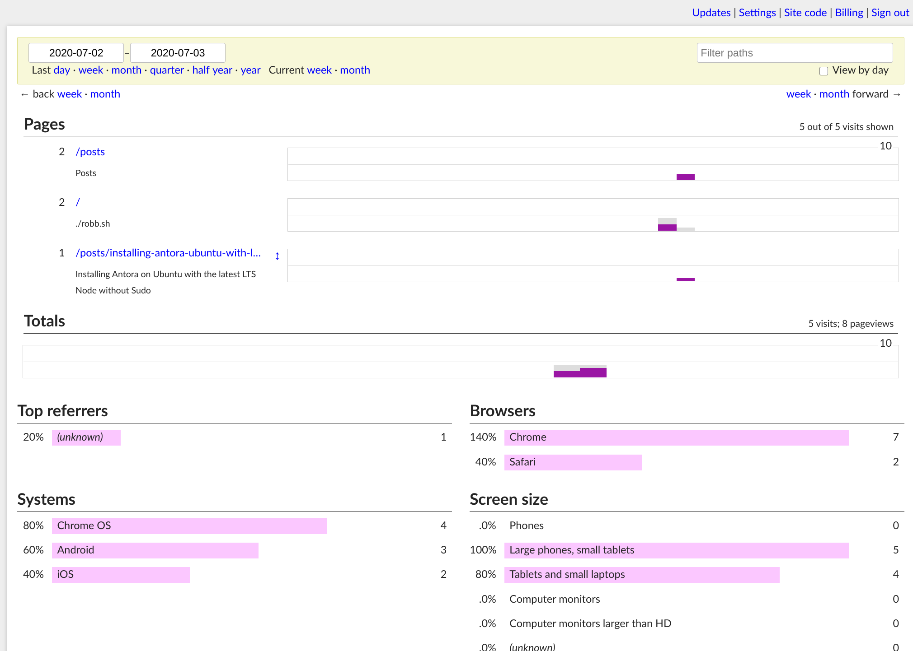

As an alternative to Google Analytics, you can use the open source
[GoatCounter](https://www.goatcounter.com/) hosted analytics solution. Setting
it up is fast and easy. You can find instructions on their website, but here are
some tips specific to [Hugo](https://gohugo.io/).

## Create an account on GoatCounter

Create an account on [the sign-up page](https://www.goatcounter.com/signup).
It's free for non-commercial use.

## Configure Hugo

1. If you set the `googleAnalytics` parameter in your `config.toml` file,
   comment it out or remove it.

1. Override your theme's analytics partial by creating a
   `layouts/partials/analytics.html` file.

    ```js
    <script data-goatcounter="https://YOURSITENAME.goatcounter.com/count"
            async src="//gc.zgo.at/count.js"></script>
    ```

1. Rebuild and republish your site. This step requires no mental energy if you
   deploy on [Netlify](https://www.netlify.com/).

## The Dashboard

Analytics collection begins immediately.



## References

* [Lightweight alternatives to Google Analytics](https://lwn.net/Articles/822568/)
* [GoatCounter on GitHub](https://github.com/zgoat/goatcounter)
* Background Photo by [Michael
  Block](https://www.pexels.com/@michael-block-1691617?utm_content=attributionCopyText&utm_medium=referral&utm_source=pexels)
  on
  [Pexels](https://www.pexels.com/photo/photo-of-mountain-goat-3225530/?utm_content=attributionCopyText&utm_medium=referral&utm_source=pexels)
