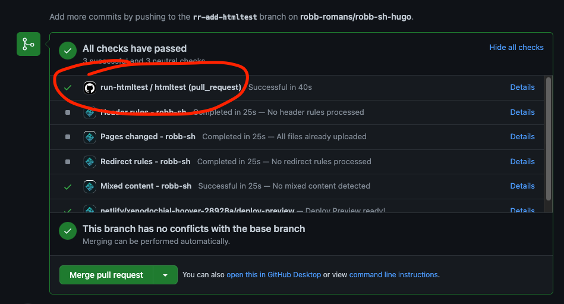

This guide shows you how to automatically check your site for broken links using GitHub Actions.

Documentation typically contains hypertext links to other sites, and over time those sites change or
disappear. Rather than wait to hear about problems with your content, a better strategy is to be
proactive and programmatically check and fix your references.

Choose a link checker that fits into the environment that builds your content. This blog publishes
by using CI/CD pipelines running Hugo to build Markdown source stored in GitHub. The
[htmltest](https://github.com/wjdp/htmltest) checker is a great fit. The project is actively
maintained, it’s written in Go like Hugo, and there’s a corresponding [GitHub
Action](https://github.com/wjdp/htmltest-action). The htmltest package tests elements such as links,
images, and alt tags. Find a complete list of checks at [what's
tested](https://github.com/wjdp/htmltest#microscope-whats-tested).

## Configure `htmltest`

To configure htmltest, create a file named
[.htmltest.yml](https://github.com/robb-romans/robb-sh-hugo/blob/main/.htmltest.yml) in the base
directory of your content repository. Specify the path to the generated HTML files.

```yml
DirectoryPath: "dist"
```

## Create the GitHub action

Let’s run htmltest whenever a pull request opens, and use GitHub Actions to handle the CI. Create a
file named
[.github/workflows/run-htmltest.yml](https://github.com/robb-romans/robb-sh-hugo/blob/main/.github/workflows/run-htmltest.yml).

1. Define the name of the action, set it to trigger on every pull request, and specify the operating
   system image for the action.

   ```yml
   name: run-htmltest
   on: pull_request
   jobs:
     htmltest:
       runs-on: ubuntu-latest
       steps:
   ```

1. Clone the content repo. A best practice with Hugo is to use Git submodules for themes. The
   checkout action can recursively clone any submodules.

   ```yml
   - name: Check out repository
     uses: actions/checkout@v2
     with:
       submodules: recursive
   ```

1. Install the latest version of Hugo.

   ```yml
   - name: Set up Hugo
     uses: peaceiris/actions-hugo@v2
     with:
       hugo-version: "latest"
   ```

1. Run Hugo to build the Markdown source into HTML. In order for the following steps to access the
   generated files, prepend the `GITHUB_WORKSPACE` directory to the path.

   ```yml
   - name: Run Hugo
     run: hugo -s site -d $GITHUB_WORKSPACE/dist
   ```

1. Run the link checker. In this example, the action always returns success. If you want to fail the
   build for broken links, set `continue-on-error` to `false`.

   ```yml
   - name: Test HTML
     continue-on-error: true
     uses: wjdp/htmltest-action@master
     with:
       config: .htmltest.yml
   ```

1. Create a GitHub downloadable artifact containing the test results.

   ```yml
   - name: Archive htmltest results
     uses: actions/upload-artifact@v2
     with:
       name: htmltest-report
       path: tmp/.htmltest/htmltest.log
       retention-days: 7 # Default is 90 days
   ```

1. Commit the files to your repo.

## Results

Now, when you open or update a pull request, GitHub triggers the `run-htmltest` action.



Click **Details** to find more information. Alternatively, you can find the most recent run by
clicking the **Actions** tab at the top of the page.


Next, click the related job to see a summary.


Click the **htmltest** rectangular dialog box and then expand the **Test HTML** section to view the
link checker output. The output in this example highlights broken links.


## Next steps

You can find the complete code for this article [in this pull
request](https://github.com/robb-romans/robb-sh-hugo/pull/17/files). To learn more about creating
your own actions, refer to the [GitHub Actions](https://docs.github.com/en/actions) documentation.
To test your actions locally, try the [act package](https://github.com/nektos/act).
