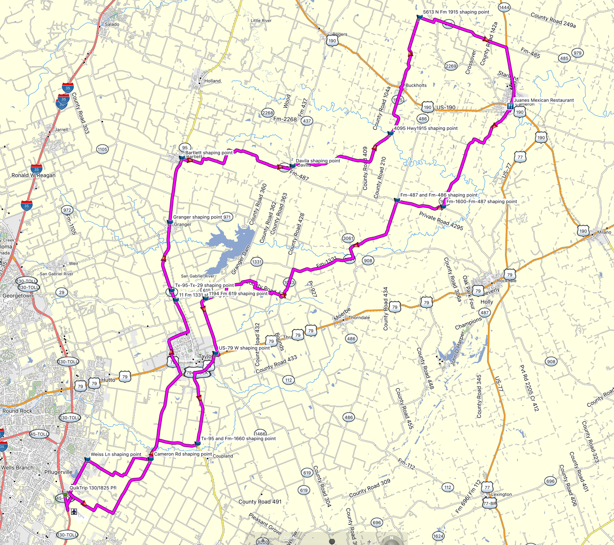

## Overview of the route

## Ride files

| Name                       | Link    |
| -------------------------- | ------  |
| Starting point map links   | [Apple Maps link](https://maps.apple.com/?address=3101%20E%20Pecan%20St,%20Pflugerville,%20TX%20%2078660,%20United%20States&auid=5169886526201139974&ll=30.420485,-97.585163&lsp=9902&q=QuikTrip) [Google Maps link](https://goo.gl/maps/otTNwwPxnpRdq2x48) |
| Starting point waypoint    | [QuikTrip-130-1825-Pfl-Waypoint.GPX](QuikTrip-130-1825-Pfl-Waypoint.GPX) |
| Destination  map links     | [Apple Maps link](https://maps.apple.com/?address=300%20W%20Fourth%20St,%20Cameron,%20TX%20%2076520,%20United%20States&auid=1705585585685360011&ll=30.853680,-96.977563&lsp=9902&q=Juanes%20Mexican%20Restaurant) [Google Maps link](https://goo.gl/maps/datZ6EczcG9VWSCU8) | |
| Destination  waypoint      | [Juanes-Mexican-Restaurant-Waypoint.GPX](Juanes-Mexican-Restaurant-Waypoint.GPX) |
| Gas station stop waypoint  | [Exxon-in-Cameron-Waypoint.GPX](Exxon-in-Cameron-Waypoint.GPX) |
| Everything in one GPX file | [FOTB-23-MLK-EastSide-All-Files.GPX](FOTB-23-MLK-EastSide-All-Files.GPX) |
| Outbound route             | [FOTB-23-MLK-Pfl-QuikTrip-130-1825-to-Juanes-Cameron-RTE.GPX](FOTB-23-MLK-Pfl-QuikTrip-130-1825-to-Juanes-Cameron-RTE.GPX) |
| Outbound track             | [FOTB-23-MLK-Pfl-QuikTrip-130-1825-to-Juanes-Cameron-TRK.GPX](FOTB-23-MLK-Pfl-QuikTrip-130-1825-to-Juanes-Cameron-TRK.GPX) |
| Inbound route              | [FOTB-23-MLK-Juanes-Cameron-to-Pfl-QuikTrip-130-1825-RTE.GPX](FOTB-23-MLK-Juanes-Cameron-to-Pfl-QuikTrip-130-1825-RTE.GPX) |
| Inbound track              | [FOTB-23-MLK-Juanes-Cameron-to-Pfl-QuikTrip-130-1825-TRK.GPX](FOTB-23-MLK-Juanes-Cameron-to-Pfl-QuikTrip-130-1825-TRK.GPX) |
